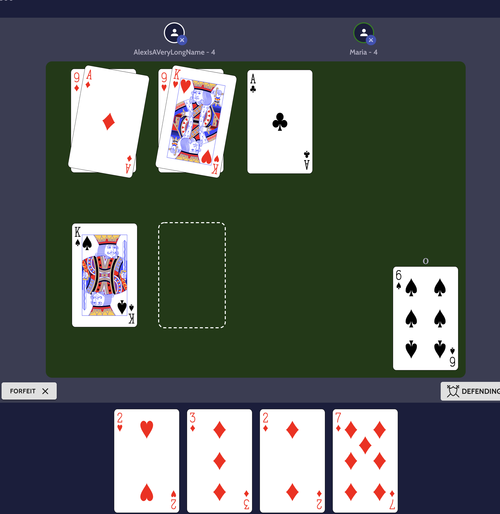

# Durachok



This is the repository that contains the sources to the Durachok game server, game client and the 
library that is shared between the two.

## Structure

The repository is structured as follows:

- `packages/web` - The client for the game, A React application that serves as the client for the game.
  
- `packages/server` - The server for the game, A Node.js application that serves as the server for the game.

- `packages/engine` - The shared library for the game, A TypeScript library that contains the shared code between the client and the server.


## Installation

1. Install the dependencies for the repository:
```bash
pnpm install
```

2. Configure the `apps/sever` environment, read the [README.md](./apps/server/README.md) for more information.


3. Configure the `apps/web` environment, read the [README.md](./apps/web/README.md) for more information.


4. Run the following command to start the development server:
```bash
pnpm run dev
```

This will start the server and the client in development mode. Congratulations! You have successfully started the development server.
